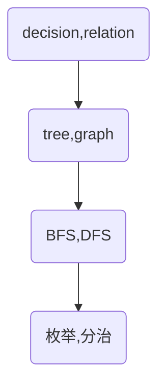

# 算法：简单操作解决复杂问题

取势；明道；优术

## 基础口诀

每日背诵❤

- 求和看前缀+二分
- 判断是包含所有：集合加判断集合长度


## 简单操作

### 枚举

- 缩小枚举范围

例子：找到所有和为0的数对

```c++
// 枚举所有数对
for (int i = 0; i < n; ++i)
    for (int j = 0; j < n; ++j)
        if (a[i] + a[j] == 0) ++ans;
// 字每句一半，另一半是逆序的关系
for (int i = 0; i < n; ++i)
    for (int j = 0; j < i; ++j)
        if (a[i] + a[j] == 0) ++ans;

// 只枚举一个数，另一个数的条件其实也确定了
bool met[MAXN * 2];
memset(met, 0, sizeof(met));
for (int i = 0; i < n; ++i) {
    if (met[MAXN - a[i]]) ++ans;
    met[MAXN + a[i]] = true;
}

```


#### 枚举手段

- 双指针
- 宽深搜
- 窗口
- 二分


### 模拟

- 手写实现的流程
- 尽量模块化代码

例子：虫子爬楼梯

```c++
int main(void) {
  int n = 0, u = 0, d = 0;
  std::scanf("%d%d%d", &u, &d, &n);
  int time = 0, dist = 0;
  while (true) {  // 用死循环来枚举
    dist += u;
    time++;
    if (dist >= n) break;  // 满足条件则退出死循环
    dist -= d;
  }
  printf("%d\n", time);  // 输出得到的结果
  return 0;
}
```


### 分治

问题划分子问题

例子：二叉树的最大深度


### 贪心

#### 取势

局部最优

#### 明道


### 排序

按照数据特点进行排列


### 前缀和&差分

预处理方式


### 二分

有序列表中折半查找


### 倍增

翻倍，线性处理转换成指数级


### 构造

构造一组数，是的满足要求


### 递推

常见动态规划DP


## 概念之间的关系

枚举和模拟：

枚举和分治：枚举是横向拓展，分治是纵向拓展

枚举和贪心：贪心是对枚举的优化

对有序的目标可采用二分和枚举的组合

排序和前缀和都是重要的预处理手段

==枚举是目的，二分，贪心都是手段==


## 解出一道算法题的思维步骤🎃

以下的论述都是在已知题型的前提下，如何在拿到一道题时快速定位所属类型呢😑？


# 问题大类

## 搜索

### 取势

- BFS：本质上是枚举-广度
- DFS：本质上是分治-深度


### 明道

#### BFS初级阶段：50题

- 枚举数量：一个，一对，多个，一层
- 枚举对象：入度为0的？
- 枚举顺序：起点？终点？哪个点确定就从哪边开始
- 区域问题
- 枚举过程：局部求解，维护局部状态
- BFS中，每个函数表示当前的状态


##### 解题步骤

- 问题定义

  - 问题的基本思路？

  - 问题定义，难点？

  - 拆分？

  - 提出解决方案？

- 设计

  - 哪些数据结构？

  - 代码逻辑？

- 转化代码
  - 按照设计的伪代码书写


##### trick

- 多个队列保持多个状态信息
- 有限的决策可以维护成枚举型
- 可以同时多个起点同时BFS，初始化多个起点
- 邻接表也可以用hash表构造
- top k可以使用堆实现


#### DFS初级阶段：50题

一张图即可：



##### 例题

- 垂直遍历 314.

相比BFS，DFS不能保证上下顺序，以下代码没有考虑节点深度。

```java
import java.util.*;

public class Main {
      public class TreeNode {
          int val;
          TreeNode left;
          TreeNode right;
          TreeNode() {}
          TreeNode(int val) { this.val = val; }
          TreeNode(int val, TreeNode left, TreeNode right) {
              this.val = val;
              this.left = left;
              this.right = right;
          }
      }
      static Map<Integer,List<Integer>> map;
      static int start;
      static int end;
      public void dfs(int col,TreeNode node) {
          if (node==null) return;
          start = Math.min(start,col);
          end = Math.max(end,col);
          if (map.containsKey(col)) {
              map.get(col).add(node.val);
          } else {
              ArrayList<Integer> temp = new ArrayList<>();
              temp.add(node.val);
              map.put(col,temp);
          }
          if (node.left!=null) {
              dfs(col-1,node.left);
          }
          if (node.right!=null) {
              dfs(col+1,node.right);
          }
      }
    public List<List<Integer>> verticalOrder(TreeNode root) {
        map = new HashMap<>();
        start = Integer.MAX_VALUE;
        end = Integer.MIN_VALUE;
        ArrayList<List<Integer>> res = new ArrayList<>();
        dfs(0,root);
        if (map.keySet().size()==0) return res;
        for (int i = start; i <= end; i++) {
            res.add(map.get(i));
        }
        return res;
    }
    public static void main(String[] args) {
    }
}
```

- 加权嵌套和Ⅱ 364.

击败了0.00%的用户哈哈😁。

```java
class Solution {
    static List<int[]> registerList;
    static int maxDepth;
    public void dfs(int depth, NestedInteger item) {
        maxDepth = Math.max(maxDepth,depth);
        if (item.isInteger()) {
            registerList.add(new int[]{item.getInteger(),depth});
            return;
        } else {
            item.getList().forEach(n->{
                dfs(depth+1,n);
            });
        }
        return;
    }
    public int depthSumInverse(List<NestedInteger> nestedList) {
        int res = 0;
        maxDepth = Integer.MIN_VALUE;
        registerList = new ArrayList<>();
        nestedList.forEach(n->{
            dfs(1,n);
        });
        for(int[] n:registerList) {
                res+=n[0]*(maxDepth+1-n[1]);
        }

        return res;
    }
}
```

- 迷宫Ⅱ 505.

注意记忆化：花费更多步到达同一个点的路径直接截断，一开始没想到🤣。

如果需要修改全局变量如visit数组，则需要在上一层处理，以便能够恢复。

```java
import java.util.HashMap;
import java.util.Map;
public class Main {
    static final Map<String,int[]> directions = new HashMap<String,int[]>(){
        {
            put("up",new int[]{-1,0});
            put("down",new int[]{1,0});
            put("left",new int[]{0,-1});
            put("right",new int[]{0,1});
        }
    };
    static int shortestPath;
    static int[][] visited;
    public boolean isIndexValid(int[][] maze,int[] index){
        int x = index[0];
        int y = index[1];
        if (x<0||x>= maze.length||y<0||y>=maze[0].length) return false;
        return maze[index[0]][index[1]]!=1;
    }

    public void dfs(int[][] maze, int step,int[] index,int[] target){
        if (index[0]==target[0]&&index[1]==target[1]) {
            shortestPath = Math.min(shortestPath,step);
            return;
        }
        for (int[] dir : directions.values()) {
            int x = index[0];
            int y = index[1];
            int stepT = step;
            while (isIndexValid(maze,new int[]{x+dir[0],y+dir[1]})){
                x+=dir[0];
                y+=dir[1];
                stepT++;
            }
            if (visited[x][y]==0||stepT<visited[x][y]) {
                visited[x][y]=stepT;
                dfs(maze,stepT,new int[]{x,y},target);
            }
        }
    }
    public int shortestDistance(int[][] maze, int[] start, int[] destination) {
        int row = maze.length;
        int col = maze[0].length;
        shortestPath = Integer.MAX_VALUE;
        visited = new int[row][col];

        dfs(maze,1,start,destination);

        return shortestPath==Integer.MAX_VALUE?-1:shortestPath-1;
    }
    public static void main(String[] args) {
    }
}
```

- 不同岛屿的数量 694.

想不出来😢。这题可以把不同岛屿的DFS过程编码下来。

也就是说，遇到计算复杂的过程可以上用编码的方式避免重复计算。

- 句子相似性Ⅱ 737.

🎈🎈🎈🎈🎈🎈🎈🎈🎈🎈搜索类先到这吧，换个二分做做。

- 树的直径 1245.
- 二叉树最近公共祖先 1644. 


### 优术


## 二分

### 取势：

关键问题：

- 看不出是二分
- 对什么进行二分
- 左域和右域的条件


### 明道

#### 二分初级阶段：50题

- **寻找某一个对象**✨
- 找单个值
- 找边界：low_bound和high_bound

- 找第k小的数 4.
- 直接枚举结果，使用二分
- 多维度二分
- 找多目标，二分寻找其中一个目标
- 最大最小，最小最大


#### 解题步骤

- 识别是一个二分问题（如何转化成）
- 属于二分中的哪一类问题：参考✨处

- 枚举对象，左域，右域条件


#### trick

- 看到求和-->前缀和+二分


#### 例题

- 二分到底怎么写？


二分基本上只是寻找上图中的十个点。

标准库只提供下界查询：>=value和>value的下界。

下标减1即可实现相应的上界。

lowerBound:

```java
static int lowerBound(int[] arr,int first,int last, int value) {
        int l  = first;
        int r = last;
        while (l < r) {
            int m = l+( r-l) / 2;
            if (arr[m] < value) { // 求上界改为<=即可
                l = m + 1;   // l=m+1是因为左闭右开
            } else { 
                r = m;  
            }
        }
        return l;
    }
```

- 较小的三数之和 259.🍔

很有意思的一道题，二分的应用。🤩

```java
import java.util.Arrays;
public class Main {
    static int lowerBound(int[] arr,int first,int last, int value) {
        int l  = first;
        int r = last;
        while (l < r) {
            int m = l+( r-l) / 2;
            if (arr[m] < value) {
                l = m + 1;     // 如果m位置的元素太小，直接把左边界跳到m+1
            } else { // 相当于 arr[m] >= value
                r = m;  // 虽然m有可能是目标解，直接m-1会错过，但是最后如果在 l 和 m -1 里面找不到， l会取“m+1”，跳出循环，这里的“m+1“其实就是错过的目标解、
            }
        }
        return l;
    }
    public int threeSumSmaller(int[] nums, int target) {
        Arrays.sort(nums);
        int i;
        int j;
        int k;
        int count = 0;
        int n = nums.length;
        for (i=0;i<n-2;i++) {
            for (j=i+1;j<n-1;j++) {
                int lb = lowerBound(nums, j + 1, n, target - nums[i] - nums[j]);
                lb--;
                if (lb>=j+1) count+=lb-(j+1)+1;
            }
        }
        return count;

    }
    public static void main(String[] args) {
        int[] nums = {0};
        int target = 2;
        int i = new Main().threeSumSmaller(nums, target);
        System.out.println(i);
    }
}
```

- 与目标颜色间的最短距离 1182. 🍟

```java
import java.util.ArrayList;
import java.util.HashMap;
import java.util.List;

public class Main {
    static int lowerBound(List<Integer> arr,int first,int last, int value) {
        int l  = first;
        int r = last;
        while (l < r) {
            int m = l+( r-l) / 2;
            if (arr.get(m) < value) {
                l = m + 1;     // 如果m位置的元素太小，直接把左边界跳到m+1
            } else { // 相当于 arr[m] >= value
                r = m;  // 虽然m有可能是目标解，直接m-1会错过，但是最后如果在 l 和 m -1 里面找不到， l会取“m+1”，跳出循环，这里的“m+1“其实就是错过的目标解、
            }
        }
        return l;
    }
    public List<Integer> shortestDistanceColor(int[] colors, int[][] queries) {
        List<Integer> res = new ArrayList<>();
        HashMap<Integer, List<Integer>> map = new HashMap<>();
        for (int i = 0; i < colors.length; i++) {
            int item = colors[i];
            if (map.containsKey(item)) {
                map.get(item).add(i);
            } else{
                List<Integer> temp = new ArrayList<>();
                temp.add(i);
                map.put(item,temp);
            }
        }
        for (int i = 0; i < queries.length; i++) {
            int target = queries[i][0];
            int color = queries[i][1];
            if (!map.containsKey(color)) res.add(-1);
            else {
                List<Integer> arr = map.get(color);
                int index = lowerBound(arr,0,arr.size(),target);
                ArrayList<Integer> indexes = new ArrayList<>();
                if (index<= arr.size()-1) indexes.add(arr.get(index));
                if (index-1>=0) indexes.add(arr.get(index-1));
                int min = Integer.MAX_VALUE;
                for (int j = 0; j < indexes.size(); j++) {
                    min =  Math.min(min,Math.abs(target-indexes.get(j)));
                }
                res.add(min);
            }
        }
        return res;
    }
    public static void main(String[] args) {
        int[] colors = {3,1,1,2,3,3,2,1,2,3,1,1,3,2,3,1,1,1,1,2,2,1,2,2,2,1,1,1,1,2,3,3,3,1,3,2,1,1,2,2,1,3,1,2,1,1,2,2,1,2};
        int[][] queries = {{10,2},{0,1},{32,3},{1,1},{41,1},{48,3},{0,3},{46,2},{48,2},{28,1},{47,2},{11,2},{49,3},{3,3},{40,1},{1,2},{42,2},{47,2},{36,3},{23,1},{7,3},{47,2},{13,3},{36,1},{17,2},{46,2},{38,2},{0,1},{38,3},{36,3},{33,1},{11,3},{39,2},{10,2},{44,3},{5,1},{36,3},{44,3},{38,1},{9,1},{9,1},{35,3},{10,1},{9,1},{0,3},{1,1},{0,3},{28,1},{22,3},{15,1}};
        List<Integer> res = new Main().shortestDistanceColor(colors, queries);
        res.forEach(n->{
            System.out.println(n);
        });
    }
}

```

- 割绳子 1891. 🌭

实际解决问题时，使用下界还是上界？🤔

- 求最大用上界
- 求最小用下界限

```java
import java.util.Arrays;
import java.util.List;
public class Main {
    static int lowerBound(List<Integer> arr,int first,int last, int value) {
        int l  = first;
        int r = last;
        while (l < r) {
            int m = l+( r-l) / 2;
            if (arr.get(m) < value) {
                l = m + 1;     // 如果m位置的元素太小，直接把左边界跳到m+1
            } else { // 相当于 arr[m] >= value
                r = m;  // 虽然m有可能是目标解，直接m-1会错过，但是最后如果在 l 和 m -1 里面找不到， l会取“m+1”，跳出循环，这里的“m+1“其实就是错过的目标解、
            }
        }
        return l;
    }
    public int getTotal(int[] robbons,int offset, int k){
        int count = 0;
        for (int robbon : robbons) {
            count+=robbon/offset;
            if (count>k) return count;
        }

        return count;
    }
    public int maxLength(int[] ribbons, int k) {
        int r = Arrays.stream(ribbons).max().getAsInt()+1;
        int l = 1;
        while (l<r) {
            int mid = l+(r-l)/2;
            int total = getTotal(ribbons, mid, k);
            if (total>=k) {
                l = mid+1;
            } else {
                r = mid;
            }
        }
        return r-1;
    }
    public static void main(String[] args) {
        int[] ribbons = {100000,100000,100000,100000,100000,100000,100000,100000,100000,100000,100000,100000,100000,100000,100000,100000,100000,100000,100000,100000,1,100000,100000,100000,100000,100000,100000,100000,100000,100000,100000,100000,100000,100000,100000,100000,100000,100000,100000,100000,100000,100000,100000,100000,100000,100000,100000,100000,100000,100000}
        ;
        int k = 49;
        System.out.println(new Main().maxLength(ribbons,k));
    }
}
```

- 从一个范围内选择最多整数Ⅱ 2557. 🧂

这道题只过了一部分例子😥，但是思路应该是可以的😃。

```java
import java.util.Arrays;
public class Main {
    static int lowerBound(int[] arr,int first,int last, int value) {
        int l  = first;
        int r = last;
        while (l < r) {
            int m = l+( r-l) / 2;
            if (arr[m] < value) {
                l = m + 1;     // 如果m位置的元素太小，直接把左边界跳到m+1
            } else { // 相当于 arr[m] >= value
                r = m;  // 虽然m有可能是目标解，直接m-1会错过，但是最后如果在 l 和 m -1 里面找不到， l会取“m+1”，跳出循环，这里的“m+1“其实就是错过的目标解、
            }
        }
        return l;
    }
    static int upperBound(int[] arr,int first,int last, int value) {
        int l  = first;
        int r = last;
        while (l < r) {
            int m = l+( r-l) / 2;
            if (arr[m] <= value) {
                l = m + 1;     // 如果m位置的元素太小，直接把左边界跳到m+1
            } else { // 相当于 arr[m] >= value
                r = m;  // 虽然m有可能是目标解，直接m-1会错过，但是最后如果在 l 和 m -1 里面找不到， l会取“m+1”，跳出循环，这里的“m+1“其实就是错过的目标解、
            }
        }
        return l;
    }
    public int maxCount(int[] banned, int n, long maxSum) {
        Arrays.sort(banned);
        int m = banned.length;
        int[] pre = new int[m];
        pre[0] = banned[0];
        for (int i = 1; i < m; i++) {
            pre[i] = pre[i-1]+banned[i];
        }
        int l = 1;
        int r = n+1;
        while (l<r) {
            int mid = l+(r-l)/2;
            int sum = (1+mid)*mid/2;
            int index = upperBound(banned, 0, banned.length, mid)-1;
            if (index>=0) sum-=pre[index];
            if (maxSum>=sum) {
                l = mid+1;
            } else {
                r = mid;
            }
        }
        r--;
        // 二分找
        int end = upperBound(banned, 0, banned.length, r);
        if (end-1>=0) r -=end;
        return r;
    }
    public static void main(String[] args) {
        int[] banned = {1,4,6};
        int n = 6;
        int maxSum = 4;
        System.out.println(new Main().maxCount(banned,n,maxSum));
    }
}

```

## 动态规划DP

### 取势

- 如何判断出用DP求解
- 状态定义
  - 选择哪些维度
- 转移方程书写


### 明道

#### DP初级阶段：50题

- DP的结果：满足条件，答案
- 对于可枚举的状态，DP可作为字典查询
- 可能存在3维DP
- 博弈论题目，关于胜负
- 状态设计可以是`进行时：上一步采用了什么策略`，也可以是`起始状态：以当前为结束`

##### 如何设计出DP数组呢？

- 穷举分析-->能够判断出该题目是否DP
  - 能够穷举==横向枚举|纵向枚举==（画图）
  - 哪些信息会==影响后续的计算==，对这一信息的定义就是维度之一

#### 解题步骤

- 构造DP数组
- 按照以上的方法，此时也能写出转移方程了
- 初始化，在明确DP定义的前提下，初始化不难（注意DP遍历方向）
- 代码书写

#### trick

- DP问题的设计需要==画图==分析


#### 例题

- 粉刷房子 256. 

简单🤣。

```java
public int minCost(int[][] costs) {
        int n = costs.length;
        int[][] dp = new int[n + 1][3];
        for (int i = 1; i < n+1; i++) {
            dp[i][0] = Math.min(dp[i-1][1],dp[i-1][2])+costs[i-1][0];
            dp[i][1] = Math.min(dp[i-1][0],dp[i-1][2])+costs[i-1][1];
            dp[i][2] = Math.min(dp[i-1][0],dp[i-1][1])+costs[i-1][2];
        }
        return Math.min(Math.min(dp[n][0],dp[n][1]),dp[n][2]);
    }
```

- 栅栏涂色 276. 

概率论和排列组合不扎实😥。

```java
class Solution {
    public int numWays(int n, int k) {
        if(n == 1) return k;
        int a = k, b = k * k;
        for(int i = 2; i < n; i++){
            int c = (a + b) * (k - 1);
            a = b;
            b = c;
        }
        return b;
    }
}
```

- 翻转游戏Ⅱ 294. 
- 最大连续1的个数Ⅱ 487. 
- 寻找错位排列个数 634. 
- 最大交替子数组 2036. 


## 滑动窗口（双指针）


## 贪心


